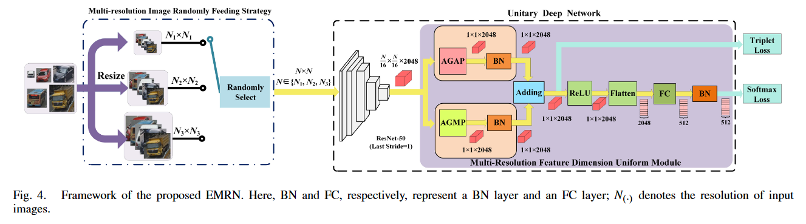

# EMRN
 IOTJ-2021：[An efficient multiresolution network for vehicle reidentification](https://ieeexplore.ieee.org/abstract/document/9569744)  





## Weights link  
Please use the link below to get trained weights.  

[Baidu Cloud](https://pan.baidu.com/s/1eoQKaZnL5g_E01OdjbgsQg?pwd=mu44)

## Training
```
#64x64:
sh train_single.sh  

#64x64 and 128x128
sh train_double.sh

#64x64, 128x128, and 256x256
sh train_triplet.sh
```


## Testing
```
sh test_veri.sh
```

## Citation

If you find this code useful for your research, please cite our paper
```
@article{shen2021efficient,
  title={An efficient multiresolution network for vehicle reidentification},
  author={Shen, Fei and Zhu, Jianqing and Zhu, Xiaobin and Huang, Jingchang and Zeng, Huanqiang and Lei, Zhen and Cai, Canhui},
  journal={IEEE Internet of Things Journal},
  volume={9},
  number={11},
  pages={9049--9059},
  year={2021},
  publisher={IEEE}
}
```
